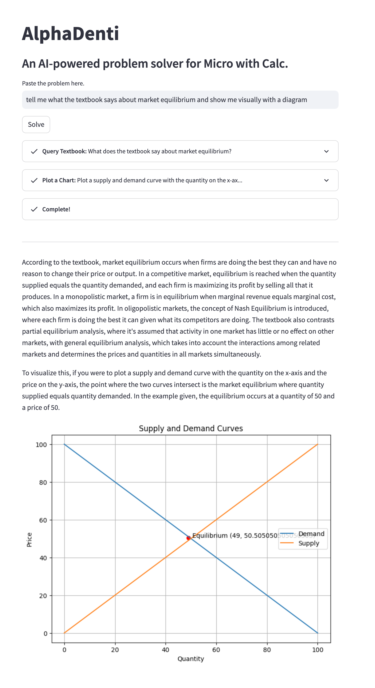
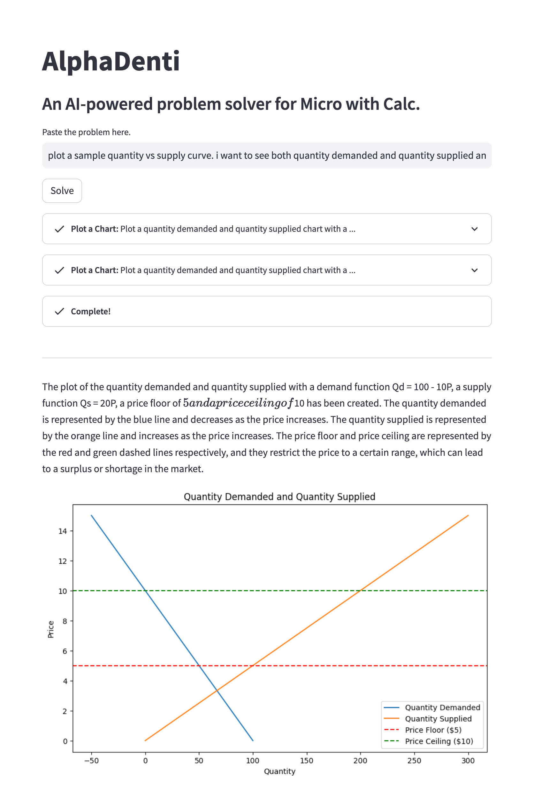

# Microeconomics Solver

AI-powered solver and explainer for Microeconomics with Calculus problems, with help from the class textbook, Wolfram Alpha, and the internet.

## Examples

_tell me what the textbook says about market equilibrium and show me visually with a diagram_

_plot a sample demand and suply curve. i want to see both demand and supply and a price floor/ceiling._

